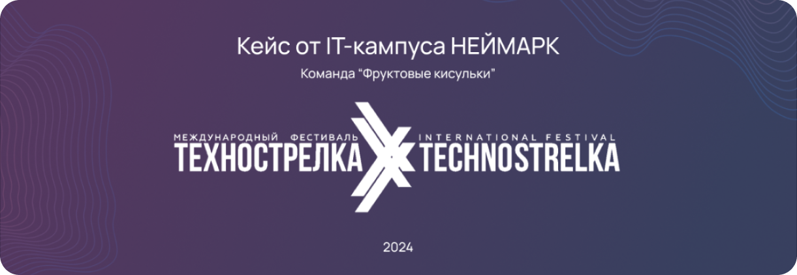
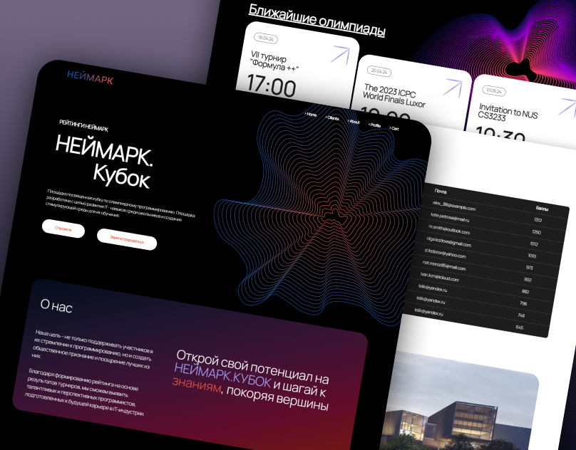
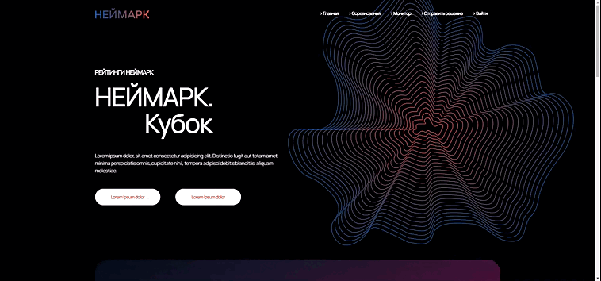

    

<h2 align="center">Хакатон "IT-EducationHack" – Основной тур</h2>
🌍<b>Задача:</b> В рамках хакатона необходимо разработать сайт с информацией о Кубке по олимпиадному программированию НЕЙМАРК и ИТ-кампусе НЕЙМАРК, должен быть сформирован список текущих и будущих олимпиад, а также должна быть предоставлена возможность создания собственных олимпиад.Обеспечить возможность привязки личного кабинета пользователя к аккаунту на следующих сайтах:
<ul>
    <li>Codeforces</li>
    <li>ACMP</li>
    <li>Яндекс.Контест</li>
</ul>

    

    

    Главная страница

<h3 align="center">В этом репозитории представлена только верстка</h3>
# neimark
